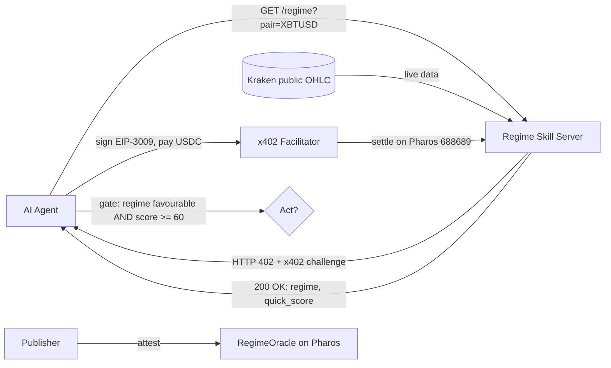

# Crypto Regime Signals — an x402 Skill for AI Agents on Pharos

[](https://github.com/Nikoble1926/crypto-regime-signals/actions/workflows/ci.yml)

## On-chain proof - Pharos Atlantic (chainId 688689)

The companion **RegimeOracle** contract (`contracts/RegimeOracle.sol`) is **deployed and source-verified on Pharos Atlantic testnet**. The Skill publisher commits the latest regime read on-chain, giving the signal a tamper-evident, queryable track record any agent or contract can verify.

- **RegimeOracle:** `0xd7ada595fbed3c2fc547c8ec57a5e581cfb3ad3e`
- **Deploy tx:** `0x53c442b81db4cab952c2bcdb0761f2424bfce7894e56fa04c72f952027c751d5`
- **First attestation** (XBTUSD -> trending_down, quick_score 36): `0x60befabd5576e5dda66044214b1e7cd11c5f90d14cc20ea6e67dac4394dd2b25`
- **Verified source on explorer** (green check, full source published): https://pharos-testnet.socialscan.io/address/0xd7ada595fbed3c2fc547c8ec57a5e581cfb3ad3e#code

Reproduce: `npm i solc && node compile.cjs && node_modules/.bin/tsx deploy_oracle.mjs` (needs a funded `.private_key` on Pharos Atlantic).

**Read the latest attestation yourself (no key, public RPC):** `node read_oracle.mjs XBTUSD` -> prints `{regime, quick_score, asof_utc, data_hash, total_attestations}` straight from the on-chain RegimeOracle.

**Submission: Pharos × Anvita Flow — Skill-to-Agent Dual Cascade Hackathon (Phase 1, Skill Hackathon).**

A reusable **Skill** that lets an AI agent buy **decision-grade market context** — a classified
market **regime** (trend + volatility + a 0–100 quick-score) for any major crypto pair — and pay
for it automatically, per call, with USDC over the **x402** protocol on **Pharos Atlantic testnet
(chainId 688689)**.

It is the natural building block for a **Phase-2 Agent**: a trading or rebalancing agent calls
this Skill first to decide *whether the current market is worth acting in*, then acts.

## Why this Skill

- **Real data, not a demo.** The signal is computed from **live Kraken OHLC** using the same
  regime methodology as the author's production engine, which already runs live on Base as an
  x402 pay-per-call API (`https://signals.nsgoods.org`) with a public, tamper-evident track record.
- **Composable & single-purpose.** One call → one regime read (`trending_up` / `trending_down` /
  `ranging` / `high_volatility`) plus a `quick_score`. Trivial to compose, cache, and gate on.
- **Native x402 + Pharos.** Built on the official `@x402/express` pattern; agents pay with USDC,
  no key, no account, no subscription.


## Architecture



A pays per call over x402; the server computes the regime from live Kraken data and returns it. The same read is attested on-chain via `RegimeOracle`. A composing agent gates its actions on `regime` + `quick_score`.

## What you get

| Endpoint | Cost | Returns |
|---|---|---|
| `GET /regime?pair=XBTUSD` | $0.01 (x402) | regime, trend, volatility, quick_score, EMAs, ATR% |
| `GET /regime/methodology` | free | how the classifier works |
| `GET /health` | free | liveness |

Example paid response:

```json
{
  "pair": "XBTUSD", "regime": "trending_up", "trend": "up", "volatility": "normal",
  "quick_score": 72, "ema_fast": 64210.4, "ema_slow": 61875.1, "atr_pct": 1.83,
  "source": "kraken-public-ohlc", "not_financial_advice": true
}
```

## Run it

```bash
npm install
cp .env.example .env     # fill PAY_TO_ADDRESS, FACILITATOR_URL, USDC_ADDRESS
npm run server           # starts the x402 server on :4021 (Pharos Atlantic 688689)

# in another shell — an agent pays for a signal:
cp .env.example .env     # fill EVM_PRIVATE_KEY (TESTNET ONLY)
npm run client "http://localhost:4021/regime?pair=ETHUSD"
```

Sanity-check the classifier without any chain/payment:

```bash
npm run regime XBTUSD
```

## Methodology

- **Trend** — EMA(12) vs EMA(26) spread as a % of price (`>0.15%` up, `<-0.15%` down).
- **Volatility** — ATR as a % of price, banded `low` / `normal` / `high`.
- **quick_score (0–100)** — composite: trend strength rewarded, excess volatility penalised.
- **regime** — derived from trend × volatility (`high_volatility` overrides at extreme ATR%).

Data: Kraken public OHLC (`https://api.kraken.com/0/public/OHLC`), no API key.

## Files

`SKILL.md` (the Agent Skill definition) · `server.ts` · `client.ts` · `regime.ts` ·
`.env.example` · `package.json`.

## Phase-2 direction

Compose this Skill into a Pharos Agent that only trades when `regime ∈ {trending_up,
trending_down}` and `quick_score ≥ 60`, sizing by volatility — turning a paid market-context
Skill into an autonomous, on-chain decision agent.

## Author

Nikolaos Dimitriadis — building payment rails for AI agents. Live x402 API on Base:
`https://signals.nsgoods.org` · X [@nickbuildsai](https://x.com/nickbuildsai).

_Educational / data service. Not financial advice._
